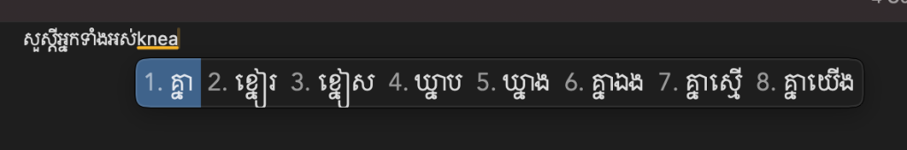
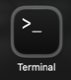

# Sing Khmer Keyboard (SingKhmer) 🇰🇭

A phonetic Khmer keyboard for macOS (and Windows). You type romanized Khmer and it gives you Khmer script — like how Pinyin works for Chinese.

`nhom` → **ខ្ញុំ** · `suosdey` → **សួស្តី** · `arkun` → **អរគុណ**


[Install](#install) • [Uninstall](#uninstall)

## How it works

You type Khmer the way you'd text a friend in English. The keyboard figures out what you mean and shows Khmer script candidates.

- Multiple spellings work — `nhom`, `knyom`, `khnom` all give you ខ្ញុំ
- Fuzzy matching is on — misspell a little and it still finds the right word
- Phrases too — type `nhomtov` and get ខ្ញុំទៅ in one shot
- It learns — the more you type, the better it gets at guessing what you want

There are 40k+ entries out of the box covering consonants, common words, and everyday phrases.

---

## Install

### 🍏 macOS

Open **Terminal** (press `Cmd + Space`, type `Terminal`, and hit `Enter`):



Run command:

```bash
curl -fsSL https://raw.githubusercontent.com/HengHuyLong/SingKhmerKeyboard/main/install.sh | bash
```

> 🔑 **Note:** Terminal may ask for your Mac password to install the keyboard engine. When you type your password, no characters will show on the screen (this is normal for security) — just type it and hit **Enter**.

Once installed, **Log out and log back in** ( → Log Out) to activate the keyboard.

Then switch keyboard with `Ctrl + Space` and start typing! 🎉

**To update in the future to get more words:**
Just run the install command again!

---

### 🪟 Windows

1. Download **[SingKhmerKeyboard-Windows-Setup.exe](https://github.com/HengHuyLong/SingKhmerKeyboard/releases/latest/download/SingKhmerKeyboard-Windows-Setup.exe)** (or visit [Releases](https://github.com/HengHuyLong/SingKhmerKeyboard/releases)).
2. Run the installer and click **Next → Install** (it automatically installs and add keyboard. Might restart your computer sometimes\*).
3. Press **`Win + Space`** to switch keyboard and start typing!

---

## What you can type

### Everyday stuff

| Type      | Get    | Meaning      |
| :-------- | :----- | :----------- |
| `suosdey` | សួស្តី | Hello        |
| `arkun`   | អរគុណ  | Thank you    |
| `nhom`    | ខ្ញុំ  | I / me       |
| `bat`     | បាទ    | Yes (male)   |
| `cas`     | ចាស    | Yes (female) |
| `somtos`  | សូមទោស | Sorry        |

### Verbs

| Type     | Get   | Meaning      |
| :------- | :---- | :----------- |
| `tov`    | ទៅ    | Go           |
| `mok`    | មក    | Come         |
| `nyam`   | ញ៉ាំ  | Eat          |
| `thvoe`  | ធ្វើ  | Do / Make    |
| `niyeay` | និយាយ | Speak        |
| `moel`   | មើល   | Look / Watch |

### Phrases

| Type          | Get          | Meaning             |
| :------------ | :----------- | :------------------ |
| `soksabyteh`  | សុខសប្បាយទេ  | How are you?        |
| `nhomtov`     | ខ្ញុំទៅ      | I go                |
| `nhomjong`    | ខ្ញុំចង់     | I want              |
| `arkunchraen` | អរគុណច្រើន   | Thank you very much |
| `tlaeyponman` | ថ្លៃប៉ុន្មាន | How much?           |

### Places

| Type        | Get        | Meaning             |
| :---------- | :--------- | :------------------ |
| `phnompenh` | ភ្នំពេញ    | Phnom Penh          |
| `kampuchea` | កម្ពុជា    | Cambodia            |
| `srokkhmer` | ស្រុកខ្មែរ | Cambodia (informal) |

---

## 📁 What are these files?

This project uses [RIME](https://rime.im), an open-source input method engine. RIME doesn't require compiling code — everything is configured through plain YAML files:

| File                    | What it does                                                                                                                |
| :---------------------- | :-------------------------------------------------------------------------------------------------------------------------- |
| `xingkhmer.dict.yaml`   | **The Dictionary** — The core word list mapping Khmer words to romanized spelling and frequency weights.                    |
| `xingkhmer.schema.yaml` | **The Schema** — Configures engine behavior, fuzzy matching rules (`nh` ↔ `ny`, `ph` ↔ `f`), and candidate window settings. |
| `default.custom.yaml`   | **The Selector** — Tells RIME to load and activate SingKhmer as your active keyboard layout.                                |

---

## 🛠️ Contributing & Local Testing

Want to add words, fix spellings, or tweak fuzzy matching? I'd love your help!

### 1. Set up for local testing

To test changes live on your machine, your RIME engine needs to read your local repo files:

**On macOS (Squirrel):**
Config files live in `~/Library/Rime/`. You can copy them over to test:

```bash
cp xingkhmer.schema.yaml xingkhmer.dict.yaml default.custom.yaml ~/Library/Rime/
```

🤖 **Or tell your AI agent on Mac:**

```text
I am on macOS. Please copy or symlink `xingkhmer.schema.yaml`, `xingkhmer.dict.yaml`, and `default.custom.yaml` from this project into `~/Library/Rime/` so I can test my Khmer keyboard edits in Squirrel.
```

> 💡 **Pro-Tip (Live editing without copying):**
> You can symlink the files directly from your cloned repo into RIME:
>
> ```bash
> ln -sf "$(pwd)/xingkhmer.dict.yaml" ~/Library/Rime/
> ln -sf "$(pwd)/xingkhmer.schema.yaml" ~/Library/Rime/
> ln -sf "$(pwd)/default.custom.yaml" ~/Library/Rime/
> ```
>
> Now, whenever you edit `xingkhmer.dict.yaml` in your code editor, just click **Deploy** in the menu bar and changes take effect immediately!

**On Windows (Weasel):**
Config files live in `%APPDATA%\Rime`. Copy the `.yaml` files there and click **Redeploy** in the Weasel tray icon.

🤖 **Or tell your AI agent on Windows:**

```text
I am on Windows. Please copy `xingkhmer.schema.yaml`, `xingkhmer.dict.yaml`, and `default.custom.yaml` from this project into `%APPDATA%\Rime` so I can test my Khmer keyboard edits in Weasel.
```

---

### 2. Adding dictionary entries

Open `xingkhmer.dict.yaml` and add your entries after the `...` line.

Format:

```
KhmerText[TAB]romanized_code[TAB]weight
```

Example:

```tsv
ខ្មែរ	khmer	200
សៀមរាប	siemreap	250
```

> [!WARNING]
> Columns **MUST be separated by real TAB characters**, never spaces. Ensure your editor is set to save in **UTF-8**.

### Weight guide

| Weight | Recommended For                                      |
| :----- | :--------------------------------------------------- |
| `100`  | Individual consonants and syllables                  |
| `200`  | General words and vocabulary                         |
| `250`  | High-frequency everyday words                        |
| `300`  | Common multi-word phrases (e.g. `nhomtov` → ខ្ញុំទៅ) |

---

## Built with

- [RIME 中州韻](https://rime.im) — input method engine
- [Squirrel 鼠鬚管](https://github.com/rime/squirrel) — macOS frontend
- [Weasel 小狼毫](https://github.com/rime/weasel) — Windows frontend

---

## Uninstall

### 🍏 macOS

Open **Terminal** and run to remove everything:

```bash
curl -fsSL https://raw.githubusercontent.com/HengHuyLong/SingKhmerKeyboard/main/uninstall.sh | bash
```

> 🔑 **Note:** Terminal may ask for your Mac password to remove files. Characters won't show on screen while typing — just enter your password and hit **Enter**.

### 🪟 Windows

1. Go to **Settings → Apps → Installed apps** (or _Add or remove programs_).
2. Find **SingKhmerKeyboard** and **Weasel (小狼毫)**, and click **Uninstall**.
3. _(Optional)_ Delete the `%APPDATA%\Rime` folder to remove any leftover configuration files.

---

## License

[MIT](LICENSE)

---

Made for the Khmer community · poggers
